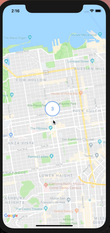
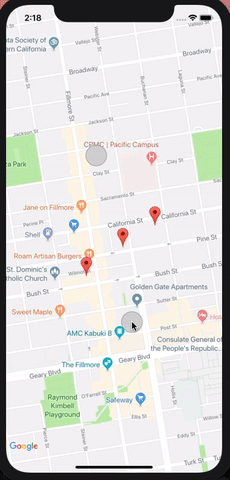
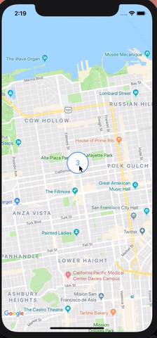
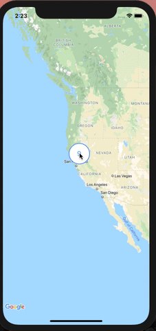
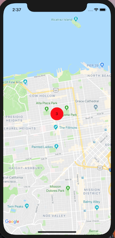

# react-native-cluster-map

[]()
[](https://www.npmjs.com/package/react-native-cluster-map)
[](https://www.npmjs.com/package/react-native-cluster-map)
[](mailto:sales@codempire.io)

React Native MapView clustering component for iOS + Android

---

Made by [CODEMPIRE](http://codempire.io/)

## Examples

| Zoom in                                                   | Zoom out                                                                |
| --------------------------------------------------------- | ----------------------------------------------------------------------- |
|               |                             |
| **Cluster Expand**                                        | **Nested Cluster Expand**                                               |
|  |  |

## Installation

1. Install [`react-native-maps`](https://github.com/react-native-community/react-native-maps/blob/master/docs/installation.md)

2. Install this component

```bash
npm install --save react-native-cluster-map
```

## Usage

```javascript
import { Marker } from 'react-native-maps';
import { ClusterMap } from 'react-native-cluster-map';

<ClusterMap
  region={{
    latitude: 37.78825,
    longitude: -122.4324,
    latitudeDelta: 0.0922,
    longitudeDelta: 0.0421,
  }}
>
  <Marker coordinate={{ latitude: 37.78725, longitude: -122.434 }} />
  <Marker coordinate={{ latitude: 37.789, longitude: -122.431 }} />
  <Marker coordinate={{ latitude: 37.78825, longitude: -122.4324 }} />
</ClusterMap>;
```

### Custom Cluster Marker

You can customize cluster marker with **renderClusterMarker** prop

> _MyMap.jsx_

```javascript
import { Marker } from "react-native-maps";
import { MyCluster } from "./MyCluster";

// ...

renderCustomClusterMarker = (count) => <MyCluster count={count} />

render () {
  const { markers, region } = this.state;
  return (
    <ClusterMap
      renderClusterMarker={this.renderCustomClusterMarker}
      region={region}
    >
      {markers.map((marker) => (
          <Marker {...marker} />
      ))}
    <ClusterMap>
  )
}

```

> _MyCluster.jsx_

```javascript
import * as React from 'react';
import { View, Text, StyleSheet } from 'react-native';

export const MyCluster = (props) => {
  const { count } = props;
  return (
    <View style={styles}>
      <Text>{count}</Text>
    </View>
  );
};

const styles = StyleSheet.create({
  width: 50,
  height: 50,
  borderRadius: 25,
  backgroundColor: 'red',
  justifyContent: 'center',
  alignItems: 'center',
});
```

### Result



## Props

| Props                    | Type         | Default                                               | Note                                     |
| ------------------------ | ------------ | ----------------------------------------------------- | ---------------------------------------- |
| **superClusterOptions**  | _Options_    | { radius: 16, maxZoom: 15, minZoom: 1, nodeSize: 16 } | SuperCluster lib options                 |
| **isClusterExpandClick** | _boolean_    | true                                                  | Enables cluster zoom on click            |
| **region**               | _Region_     | **_required_**                                        | Google Map Region                        |
| **priorityMarker**       | _ReactNode_  | null                                                  | Marker which will be outside of clusters |
| **renderClusterMarker**  | ():ReactNode | () => { return \<CustomClusterMarker /> }             | Returns cluster marker component         |
| **clusterMarkerProps**   | _object_     | undefined                                             | Additional ClusterMarker props           |
| **style**                | _StyleProp_  | absoluteFillObject                                    | Styling for MapView                      |

---

> Also contains react-native-maps [\<MapView /> Props](https://github.com/react-native-community/react-native-maps/blob/master/docs/mapview.md#props)

## Events

| Event Name         | Returns                                                          | Notes                                                                     |
| ------------------ | ---------------------------------------------------------------- | ------------------------------------------------------------------------- |
| **onClusterClick** | ({ clusterId: number, coordinate : LatLng }, children: Marker[]) | Callback that is called when the user pressed on the **_cluster_** marker |
| **onZoomChange**   | void                                                             | Callback that is called with updated map zoom in **number**               |

---

> Also contains react-native-maps [\<MapView /> Events](https://github.com/react-native-community/react-native-maps/blob/master/docs/mapview.md#events)
